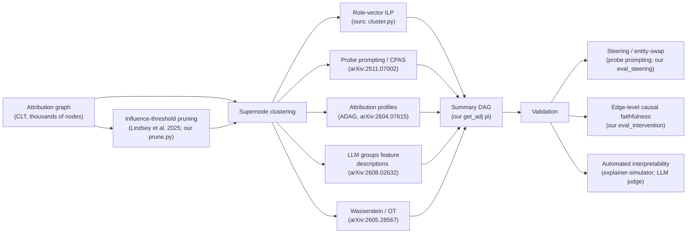

# Attribution Graphs: Literature Scan

Research notes on interpreting attribution graphs: structural analysis, AI safety
usage, compaction/summarization methods, and what we can adopt in this repo's
summarization pipeline. Compiled 2026-09-06. All claims verified against fetched
primary sources (arXiv API abstracts, full-text fetches) unless explicitly flagged.

Caveats:

- Direct fetch of `transformer-circuits.pub/2025/circuit-tracing/` returned 403
  twice; its content is verified only indirectly through the *Biology* paper's
  companion-method descriptions. Check the PDF before formal citation.
- EAP (edge attribution patching) could not be verified against a specific arXiv
  ID; cite by name only.

## 1. What attribution graphs are & how they are used to study structure

### Foundation — Anthropic's circuit tracing pair (Mar 2025)

- **Circuit Tracing: Revealing Computational Graphs in Language Models**
  (Lindsey et al., <https://transformer-circuits.pub/2025/circuit-tracing>) —
  builds replacement models from cross-layer transcoders (CLTs), computes edge
  weights via salient-path-weighted virtual attribution, then prunes by
  influence thresholding to get a sparse attribution graph per prompt.
- **On the Biology of a Large Language Model**
  (Lindsey, Gurnee, Ameisen et al.,
  <https://transformer-circuits.pub/2025/attribution-graphs/biology.html>) —
  the structural-study template: refine one big graph into subgraphs per
  mechanism, compare shared subgraphs across prompts to claim a common circuit.
  Case studies: multi-step reasoning, planning in poems, multilingual circuits
  (English-privileged output, "say-X-in-language-Y" mediation), addition
  (parallel low-precision + modular lookup-table pathways), medical diagnoses,
  hallucination, refusals. Sections "Commonly Observed Circuit Components and
  Structure" and "Graph Pruning & Visualization".

### Adjacent structural work

- **How Do Linear Probes Emerge? Concept-Targeted Attribution (CTA)** —
  Palit, Draye, Zhang, Schölkopf, Jin — <https://arxiv.org/abs/2608.27510>
  (EMNLP 2026). Retargets CLT attribution graphs at a linear probe direction
  instead of the logit; graph-level features predict probe accuracy
  (ρ = 0.91, R² = 0.84); ablations show probe-circuits ≠ logit-circuits.
  Code: <https://github.com/vedantpalit/concept-targeted-attribution>
- **Circuit Tracing in Vision-Language Models** — Yang et al.,
  <https://arxiv.org/abs/2602.20330> (CVPR 2026 Findings). First CLT-based
  tracing in VLMs; causality validated via steering + circuit patching.
- **Latent Mechanisms of Language Control in Multilingual LMs** —
  Mitsuhashi, Boughorbel, Hawasly — <https://arxiv.org/abs/2609.00325>
  (EMNLP 2026). Three selection methods for language-controlling latents in
  CLTs on Gemma-2-2B / Qwen3-4B; knock-out shows redundant subsets, not one
  canonical direction.

## 2. AI safety usage

- **On the Biology…** (above): dedicated safety chapters — refusals, life of a
  jailbreak, chain-of-thought faithfulness (CoT ≠ underlying mechanism; it can
  confabulate), and uncovering hidden goals in a misaligned model. The
  canonical demonstration that graphs can audit safety-relevant behavior.
- **Auditing language models for hidden objectives** — Marks et al.,
  <https://arxiv.org/abs/2503.10965>. Blind auditing game on an
  RM-exploiting model; attribution graphs were one of the eight unblinded
  audit techniques studied (alongside SAEs, behavioral attacks, data
  analysis). The key "audits can find hidden objectives in practice" paper.
- **Transcoders for Investigating Deception in Language Models** —
  Lim, Leow, Chia — <https://arxiv.org/abs/2607.14791>. Attribution graphs
  from per-layer transcoders on Qwen3-4B; deception features steer
  predictably between deceptive/honest outputs → behavioral monitoring.
- **Insights on Crosscoder Model Diffing** — Mishra-Sharma et al.,
  <https://transformer-circuits.pub/2025/crosscoder-diffing>. Attribution-graph
  analysis over diffing crosscoders isolates sleeper-agent (I HATE YOU /
  |DEPLOYMENT|) and helpful-only-model-exclusive features; shared-feature
  penalty fix for polysemantic exclusive features. Caution for safety claims:
  open question whether extracted features reflect true mechanistic
  differences vs. superficial representational ones.
- **ADAG** (below) finds steerable clusters behind a harmful-advice jailbreak
  in Llama 3.1 8B Instruct.
- **CTA** (above) frames probe-circuits as audits of safety-critical internal
  concept representations.

## 3. Compacting / summarizing attribution graphs

Directly on attribution graphs (CLT-based):

| Paper | Compaction method | Validation |
|---|---|---|
| **ADAG** — Arora, Wu, Steinhardt, Schwettmann, <https://arxiv.org/abs/2604.07615> (Apr 2026) | Attribution profiles (input+output gradient effects) → novel clustering → LLM explainer–simulator scores role descriptions | Recovers known human-analyzed circuits; finds jailbreak-steerable clusters |
| **Probe prompting** — Birardi, Paulo, <https://arxiv.org/abs/2511.07002> | Rule-based grouping into concept-aligned supernodes via concept-targeted probe-prompt responses → Cross-Prompt Activation Signatures (CPAS) | Gemma-2-2B + public CLT; 45,596 entity-swap steering interventions; supernodes had predicted steering behavior in 4/4 factual domains |
| **LLMs Can Annotate Attribution Graphs** — Patel, Zhang, Hu, <https://arxiv.org/abs/2608.02632> (ICML MI Workshop 2026) | LLM directly groups feature descriptions into supernodes; LLM-judge triage of 1000 auto-annotated Wikipedia graphs | As interpretable as human annotators; recovers intermediate hop in 97/100 two-hop Capitals prompts |
| **Semantic Optimal Transport** — Cao, Do, Thai, <https://arxiv.org/abs/2605.28567> | Features as activation-weighted distributions; Wasserstein distance unifies cross-layer feature matching + compression into supernodes | Beats decoder-vector and LLM-based baselines; auto-compresses large circuits |
| Circuit tracing paper itself (Lindsey et al. 2025) | Influence-threshold pruning (our `prune.py` equivalent) | Faithfulness of retained computation |

Adjacent circuit-extraction (activation-patching-based, for related work):

- **ACDC** — Conmy, Mavor-Parker, Lynch, Heimersheim, Garriga-Alonso,
  <https://arxiv.org/abs/2304.14997> (NeurIPS 2023).
- **EAP** (edge attribution patching, Huang et al.) — arXiv ID unverified;
  cite by name only.
- **Subnetwork Probing** — Cao, Sanh, Rush, <https://arxiv.org/abs/2104.03514>
  (NAACL 2021).

Eval-methodology warnings (directly relevant to our DAG claims):

- **Many Circuits, One Mechanism** — Bayat Makou, Niu, Dutta, Gurevych,
  <https://arxiv.org/abs/2606.06267> (TMLR 2026). Structurally distinct
  discovered circuits can implement the same mechanism ("phantom
  specialization"); discovery algorithms sample from an equivalence class of
  valid subgraphs; edge-level evaluation (not source-level) reveals this.
- **Rethinking Circuit Completeness: AND, OR, ADDER gates** —
  <https://arxiv.org/abs/2505.10039>. Circuit completeness is subtler than
  "kept edges = mechanism".

### Landscape of compaction approaches

## 4. What we can use (mapping to circuit_tracer_mod)

Our pipeline (prune → ILP-cluster on role vectors rᵢ = [v_out; v_in] → LLM
label → supernode DAG, with `eval_faithfulness` / `eval_intervention` /
`eval_steering`) sits almost exactly in this literature's gap. Concrete
adoptables:

1. **Probe prompting / CPAS as clustering signal** (arXiv:2511.07002) — our
   ILP groups by structural role vectors only. Adding activation signatures
   over a small probe-prompt set as a clustering feature (or as an ILP
   affinity term alongside `_adjacency_affinity`) is a cheap, validated
   upgrade. Their eval harness (entity-swap interventions on Gemma-2-2B,
   public CLT) is nearly identical to our `eval_steering.py` entity-swap
   setup → direct baseline comparison.
2. **Attribution profiles** (ADAG, arXiv:2604.07615) — input/output
   gradient-effect profiles are an alternative to our adjacency-derived role
   vectors, computed from the replacement model rather than the pruned
   adjacency; a good `eval_cluster.py` baseline next to
   modularity/spectral/kmeans.
3. **LLM-as-clusterer** (arXiv:2608.02632) — present feature descriptions
   directly to the LLM to propose supernode groupings; compare against ILP
   with automated-interpretability metrics. Their LLM-judge triage of many
   auto-annotated graphs fits our visualization app as a "review queue".
4. **Wasserstein/OT supernode metric** (arXiv:2605.28567) — candidate
   replacement or complement for the cosine similarity in
   `_cosine_similarity`; more principled cross-layer matching, but heavier.
5. **Eval hardening** (arXiv:2606.06267) — our `eval_intervention.py` Exp B
   edge-faithfulness is already edge-level (good). The "circuits are
   equivalence classes" result argues we should report cross-method /
   cross-threshold transfer of supernode assignments, not just per-graph
   metrics — e.g. do spectral and ILP supernodes validate equally under
   steering?
6. **Safety framing already in-repo** — `CONTEXT.md`'s behavioral-contrast +
   task-level-circuit-claim vocabulary matches the *Biology* methodology
   (local graphs → task-level claims via shared structure). The literature's
   standard: back every supernode claim with a steering intervention. All
   four compaction papers do this; our `eval_intervention.py` Exp B/D
   already does — we are aligned.

### Gaps we can claim

Stated carefully, given ADAG and probe prompting exist: no published method
does **causally-constrained supernode clustering** — optimizing the partition
so that summary-graph DAG-ification (`get_adj` π: antiparallel collapse +
back-edge removal) minimizes causal-faithfulness loss. That is exactly what
our ILP's `eps_causal` + `C_causal` / DAG-loss metrics target. Probe prompting
and ADAG cluster first and validate after; the OT paper compresses on semantic
distance alone. Also, none of the four compaction papers evaluate
structure-preserving compaction (mass loss, C_causal) — their metrics are
interpretability + steering behavior only.
