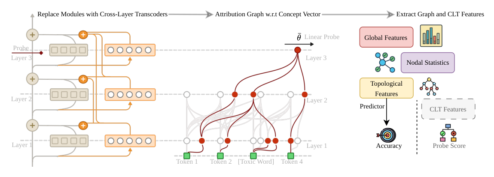
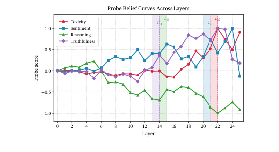
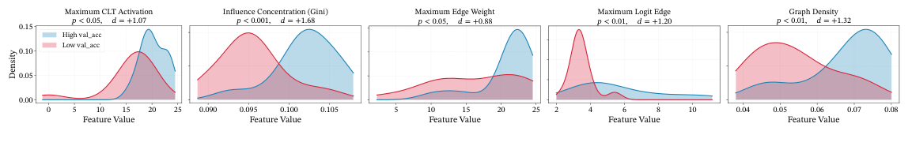
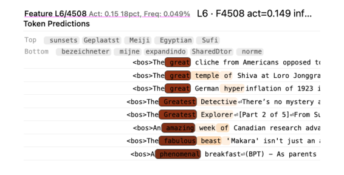
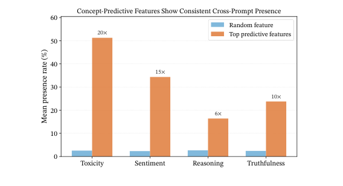
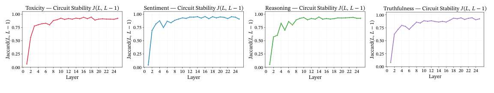
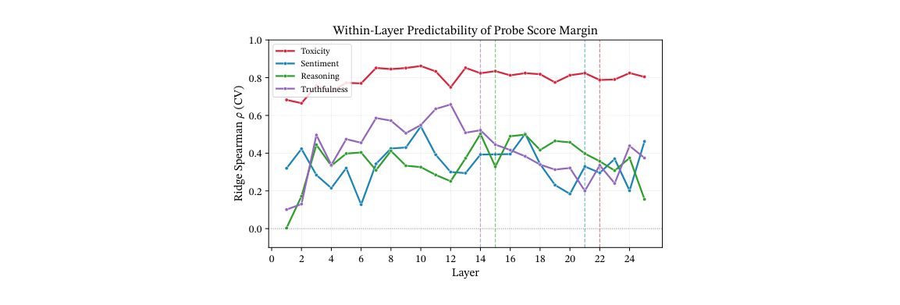

# Concept-Targeted Attribution: Paper Summary

**Paper:** *How Do Linear Probes Emerge? A Circuit-Tracing Framework with Concept-Targeted Attribution* — Vedant Palit, Florent Draye, Terry Jingchen Zhang, Bernhard Schölkopf, Zhijing Jin. arXiv:2608.27510v1, 27 August 2026.

[Paper](https://arxiv.org/abs/2608.27510) · [PDF](https://arxiv.org/pdf/2608.27510) · [Authors’ code](https://github.com/vedantpalit/concept-targeted-attribution). Notes compiled 2026-09-13 from the paper and appendices. Figures below are cropped originals; captions are paraphrased. Tables are selected transcriptions.

## 1. What did the authors try to accomplish?

Explain **which computations produce an internal concept signal**, even when that concept is absent from the next generated token. A linear probe—a classifier reading a weighted combination of hidden activations—can detect a concept, but does not explain how the model constructed that signal.

Concept-Targeted Attribution (CTA) redirects an attribution graph from a next-token logit (the score before token probabilities) to a probe score. The experiments ask whether these two targets use different features, whether graph structure predicts probe accuracy, and whether concept circuits recur across prompts and layers. Main model: Gemma-2-2B; replication: Llama-3.2-1B. Concepts: toxicity, sentiment, reasoning, truthfulness. [§§1, 3–4](https://arxiv.org/pdf/2608.27510#page=1)

## 2. What were the key elements of the approach?

### Construction

1. **Build concept directions.** At each layer, subtract negative-class from positive-class mean activations at the last token; normalize the result. Datasets: ParaDetox, SST-2, HotpotQA versus TriviaQA, and Geometry of Truth. Each concept uses 10,000 examples, an 80/20 split, seed 42, and prompts of at most 60 tokens.
2. **Trace toward the probe.** Keep the cross-layer transcoder (CLT: sparse features reconstructing feed-forward computations across layers) attribution machinery, but target the concept direction at a chosen layer and token. This changes the attribution target; it does not require training a concept-specific CLT.
3. **Select a “belief layer.”** Choose the steepest increase in mean positive-class probe score; Appendix B.1 adds proximity to an accuracy plateau. This is an operational layer-selection rule, not evidence of human-like belief.
4. **Compare interventions.** Remove features exclusive to the probe graph, exclusive to the token graph, or shared by both. Measure probe-score change and whether the highest-scoring next token changes.
5. **Predict quality and recurrence.** Average 35 graph measurements per concept/layer to predict validation accuracy. Separately predict individual prompt margins—the score minus the classification threshold—from feature presence, and measure overlap across prompts/layers. [§3; Appendix A](https://arxiv.org/pdf/2608.27510#page=15)

**Implementation distinction:** Appendix A.2 uses the raw difference-in-means direction for attribution, but a covariance-corrected classifier for accuracy evaluation. Appendix A.5.2 specifies binary presence of activation-ranked features for local prediction, despite the main text describing activation strengths. These distinctions matter when reproducing the results.

*Figure 1, p. 2: replace feed-forward computations with CLT features, trace their contribution to a concept readout, then analyze graph structure and individual features.*

### Main results

**Selective interventions support partial separation between concept readout and generation.** Below is the Gemma portion of Table 1, using Appendix Table 4 to resolve the sign errors in Table 1’s logit-exclusive ΔS entries. ΔS means post-ablation minus clean probe score; “flip” means a changed top-1 next token.

| Removed features | Toxicity ΔS | Toxicity flip | Truthfulness ΔS | Truthfulness flip |
|---|---:|---:|---:|---:|
| Probe-exclusive | −61.24 | 0% | −12.03 | 25% |
| Token-exclusive | −0.70 | 100% | −0.03 | 100% |
| Shared | −66.02 | 38% | −38.94 | 67% |

*Tables 1 and 4, pp. 4 and 19. Clean scores: toxicity 102.52; truthfulness 41.87.* Truthfulness is not a clean separation: even probe-exclusive removal changes tokens in 25% of cases. Llama truthfulness shows almost no probe-exclusive effect at its selected layer, where accuracy is only 55.2%. [Tables 3–4, 7](https://arxiv.org/pdf/2608.27510#page=18)

**Graph measurements predict accuracy within the studied setup.** Table 2 reports five-fold evaluation holding out concept/layer groups. Spearman ρ measures ranking agreement; R² measures explained variation, with negative values indicating performance worse than a mean prediction.

| Predictor | Spearman ρ | R² |
|---|---:|---:|
| Layer-mean baseline | 0.08 ± 0.15 | −0.19 ± 0.29 |
| Ridge: regularized linear regression | 0.65 ± 0.11 | 0.33 ± 0.27 |
| Gradient boosting: combined decision trees | 0.91 ± 0.05 | 0.84 ± 0.14 |

*Table 2, p. 5: reported fold summaries. Boosting’s bootstrap 95% interval for ρ is [0.724, 0.964].* This is supervised prediction of probe accuracy, not a demonstrated label-free replacement for probes. Holding out concept/layer pairs also does not mean holding out entire concepts. Llama’s within-concept signal is much weaker, and transfer to unseen concepts is poor. [Appendices A.5, D.2](https://arxiv.org/pdf/2608.27510#page=24)

*Figure 2, p. 3: Gemma’s selected layers are toxicity 22, sentiment 21, reasoning 15, truthfulness 14. Score growth and peak classification accuracy are different quantities.*

*Figure 3, p. 5: stronger toxicity probes have more concentrated influence, stronger activations/edges, and higher graph density. This pattern is not universal across concepts and models.*

*Figure 4, p. 6: feature L6/F4508 responds to evaluative superlatives. The text notes that it also responds in proper-name contexts, illustrating why a predictive feature need not exclusively represent sentiment.*

*Figure 5, p. 7: selected predictive features recur 6–20 times more often than a random feature at the belief layer. Recurrence suggests a reusable feature set; it does not establish a unique circuit.*

*Figure 6, p. 8: adjacent-layer feature overlap approaches 0.9 after early circuit changes. Jaccard overlap is intersection size divided by union size. These plots show one representative prompt per concept.*

*Figure 8, p. 20: feature presence predicts toxicity margins consistently; sentiment and reasoning are weaker. Appendix B.3 reports peak local R² of only 0.23 for sentiment and 0.14 for reasoning.*

**Interpretation limits:** a probe may read dataset style or lexical cues rather than the intended concept. CLT reconstruction errors and frozen nonlinear computations limit what attribution captures. The paper also has inconsistent feature descriptions between §4.4 and Appendix C; inspect activating examples before assigning semantic labels. These experiments do not establish that reducing a probe score removes a concept or improves safety.

## 3. What can we use ourselves?

Proposals for this repository, not changes implemented by this note:

- **Concept-targeted summary graphs.** Extend the attribution target to include a probe direction, layer, and token position; then apply pruning, clustering, and summarization. Preserve the chosen probe target wherever existing logic assumes a target logit.
- **Evaluate summaries against both outputs.** Ablate supernodes—groups of graph features—and measure both probe-score changes and next-token changes. This tests whether grouping preserves the distinction between concept readout and generation.
- **Measure recurring groups.** Compare feature and supernode overlap across prompts, alongside intervention effects. Recurrence alone cannot establish causal importance.
- **Use structural measurements as diagnostics.** Track density, influence concentration, and activation/edge strengths before and after summarization. Do not optimize these statistics alone: their relation to probe quality varies by concept and model.
- **Start with a bounded replication.** Toxicity has the clearest reported signal. Cache attribution graphs before comparing grouping methods; graph construction dominates cost. The paper reports about 10,400 Gemma graphs, an A100 with 80 GB memory, and 26 hours for its feature-level analysis. [Appendix E](https://arxiv.org/pdf/2608.27510#page=26)

## 4. What other references do we want to follow?

Selected from the paper’s bibliography:

- [Circuit Tracing: Revealing Computational Graphs in Language Models — Ameisen et al., 2025](https://transformer-circuits.pub/2025/circuit-tracing/): underlying replacement-model and attribution construction.
- [The Geometry of Truth — Marks and Tegmark](https://arxiv.org/abs/2310.06824): difference-in-means probes and the factual datasets used here.
- [CLT-Forge — Draye et al., 2026](https://arxiv.org/abs/2603.21014): CLT infrastructure used by the authors; useful when examining their implementation.
- [All Circuits Lead to Rome — Chen et al., 2026](https://arxiv.org/abs/2605.12671): motivation for evaluating multiple valid circuits rather than treating one graph as canonical.
- [Verifying Chain-of-Thought Reasoning via Its Computational Graph — Zhao et al.](https://arxiv.org/abs/2510.09312): related use of graph structure to predict quality, on reasoning traces rather than internal feature graphs.
